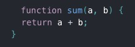

# react-study
学习react

## 概念
1.组件类（react扩展类）

2.JSX，组件类
> 相比函数式组件，类组件有一些额外的特性

3.受控组件
>不同于函数式组件，受控组件是一个react扩展类
就是作为一个组件，没有自身的数据和处理函数，都是从父组件传过来的，只负责渲染

4.函数式组件

5.ReactDOM.render()
> 它可以将JSX语法转换成HTML的DOM（真实的DOM结构）

6.纯函数
> 不会试图改变输入：

相反，下面是非纯函数，以为他改变了自身的输入值

